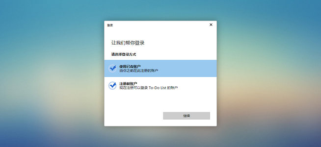
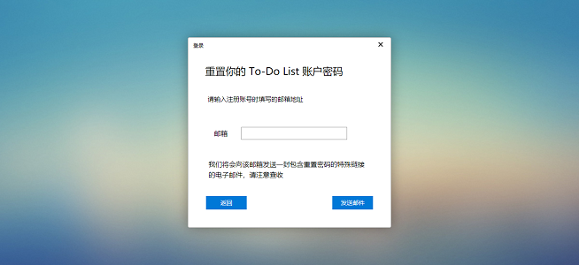
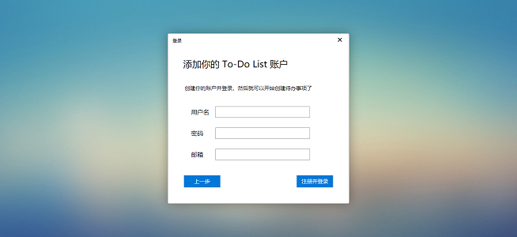
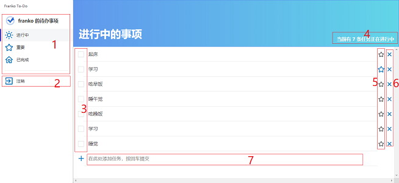

**合理地安排自己的工作与生活吧！**
## Franko To-Do List

### 一、总览
此项目是使用 React 构建的在线的待办事项管理系统。在这里注册帐号后，你就可以便捷地添加自己的任务与计划，并操作它们。此外你还不需要担心存放在这里的信息是否会丢失，用户不管在哪个浏览器上，只要登入上次的帐号，就能继续管理之前创建的任务了。即便是密码丢失也能够使用自己的邮箱找回，保证了信息的安全性。

这个待办事项是我的一个 React 学习的练手项目，是由 Create React App 构建的。在开发这个项目的过程中，实际上用到的都是一些 React 的基础知识，某些功能在实现上看起来并不优雅，所以这个项目可能并不够完美，只能说是刚好达到够用的水平。不过麻雀虽小，五脏俱全，这个 To-Do List 作为我学习前端第一个完结的项目，这里还是可以让我向大家介绍介绍的。

这个待办事项主要实现了一下功能：

* 帐号的登入与注册
* 使用邮箱找回账号
* 任务的添加、完成、标星、删除
* 任务列表的切换
* 登录状态的保存

主要使用到了以下技术：

* 后台：LeanCloud 数据存储 API
* 前端：React、SCSS、webpack、yarn、iconfont、SVG

这是这个项目的预览链接与代码链接：[http://franko.top/Todo-List/build/index.html](http://franko.top/Todo-List/build/index.html)。进入链接之后就可以看到项目的效果，样式实际上是参考了 Microsoft To-Do List 的，当然做得比人家还差得远，尽管我花了比较多的时间写这些样式，我这个算是个多快好省的版本。现在我就来介绍一下这个待办事项的主要内容吧。

## 二、使用待办事项
首先，如果想要使用这个待办事项就要有自己的帐号，因此在使用前必须进行登录或注册的操作。这个项目我们使用 LeanCloud 作为我们的数据库，同时借助 LeanCloud 提供的一系列接口来实现用户信息管理的功能。其中主要包括用户的登录、注册（要提供邮箱）、密码找回（借助邮箱）、登出等操作。具体的文档内容在「[数据存储开发指南 · JavaScript - 用户](https://leancloud.cn/docs/leanstorage_guide-js.html#hash954895)」，实现起来并不难，在 React 组件中导入并使用 LeanCloud 给我们的相应接口，照着文档上做就可以实现相应的功能了。

用户在使用帐号登录后，其帐户信息被保存在客户端。因此在用户进入页面前，就会自动读取客户端中存放的上次登录的用户信息，判断用户信息是否为空，为空就跳转到登录页面让用户登录，如果不为空就跳转到首页。如果不调用登出方法，当前用户的缓存将永久保存在客户端。

值得一提的是重置密码的操作。因为每个邮箱只能对应地注册一个帐号，因此使用邮箱找回密码是可行的。在这里只能通过 LeanCloud 提供的接口进行重置密码的操作，只需要提供邮箱帐号，相应的邮箱就会收到重置密码的链接。除此之外，即便是在 LeanCloud 的数据库中密码也不会明文展示，因此帐号是足够安全的。

登录帐号后，我们就可以进入到待办事项的界面了。整个界面的大致结构也比较简单，主要由侧边栏、标题栏、任务列表构成，效果如下图所示。接下来我们就对这幅图所展示的内容进行介绍：

图中一共有七处标记，这些标记的区域分别具有如下功能：

1. 切换不同状态的待办事项展示列表，具有进行中、重要、已完成三种状态；
2. 注销当前帐号，回退到登录界面；
3. 勾选任务项，被勾选的任务状态会被切换为已完成；
4. 当前界面下任务的数目；
5. 任务项目标星，被标星的任务被视为重要任务；
6. 删除任务，删除的任务将不再显示在页面中；
7. 添加任务项的输入框；

每条添加的任务都有三种状态：未完成、重要、已完成，可以在侧边栏中切换展示相应状态的任务，任务的三种状态在界面中自由切换。目前待办事项条目只支持增加与删除，并不支持修改，如果对某条事项不满意只能删除后再重新编写。

## 四、总结
整个项目的结构非常简单，没有什么高级的操作。对于 React 主要也就涉及到组件的一些基础操作，使用 state 管理组件内部状态，使用 props 做父子组件之间的通信。因为这个项目并不复杂，组件通信基本都是在父子层面的，所以都并没有使用 eventHub 或者 React-Redux 做组件通信。至于样式，虽然只是粗略的模仿，在我重构代码的时候也花了不少时间，确实锻炼了一番我写样式的能力，在这里感谢微软提供的创意吧。